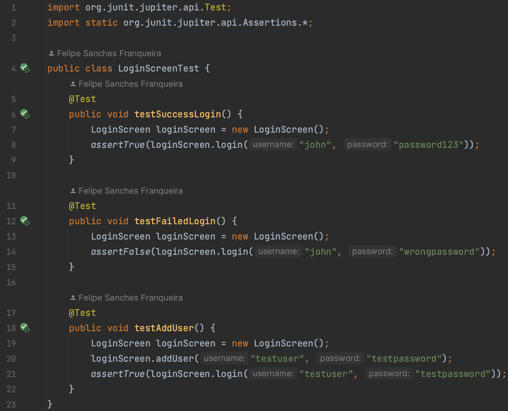
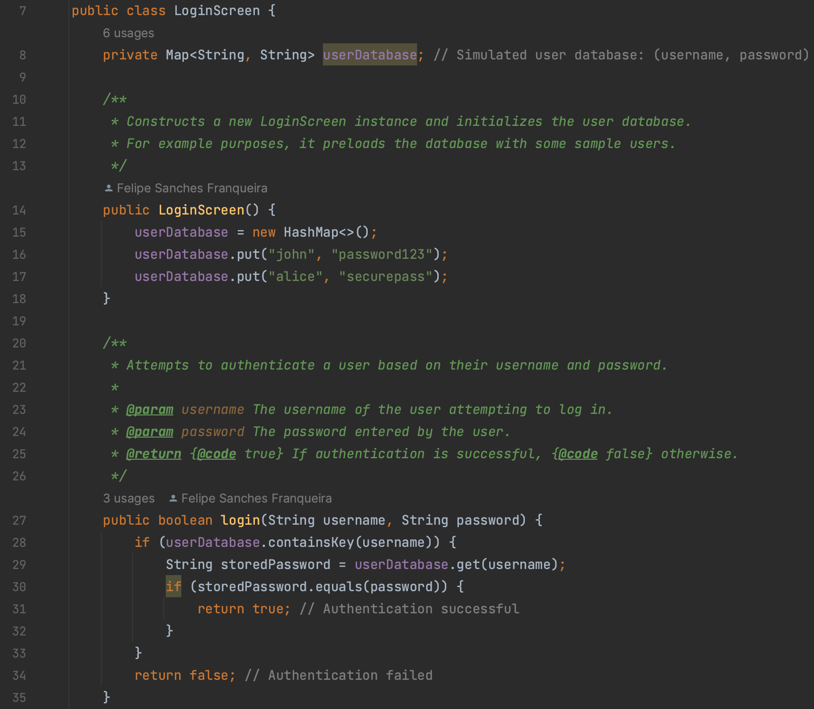
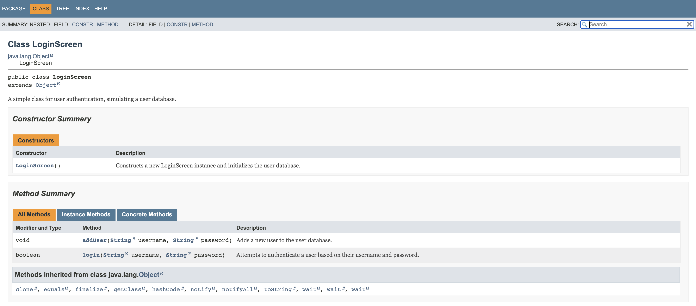

# Test Driven Development - Tela de Login
## Descrição
Este projeto se trata de um estudo sobre Test Driven Drevelopment (TDD), uma prárica onde o
código para teste de unidade é escrito antes do código a ser testado, fazendo com que o código
tenha uma melhor legibilidade e uma menor complexidade. 
Para este estudo foi criado a classe `LoginScreenTest` com os testes unitários, e só apos os 
testes falharem que foi criada a classe `LoginScreen`, atendo a necessidade doss testes. Por 
fim a classe `LoginScreen` foi documentada e o JAVADOC exportado.

## Classe de Testes
Abaixo está uma imagem da clase de testes criada.

## Classe LoginScreen
Abaixo está as imagens de um trexo da classe `LoginScreen` junto da sua documentação.

## Ultima atulização 07/11/2023